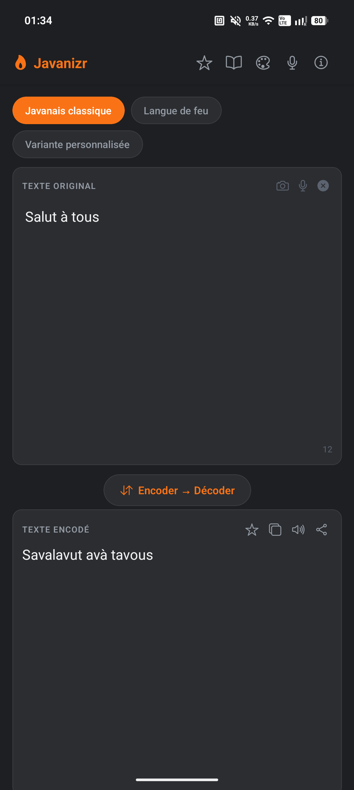
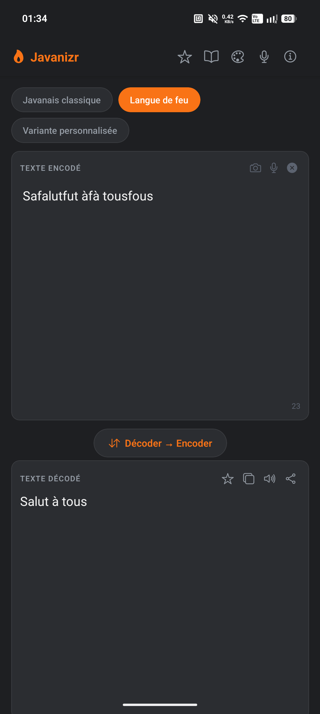
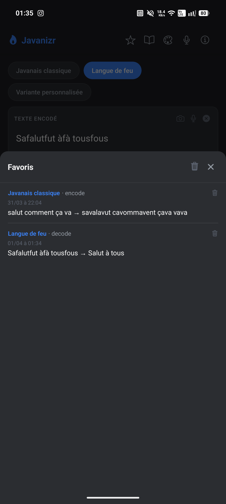
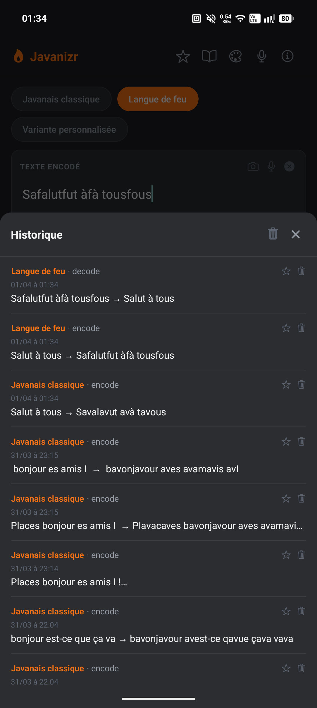
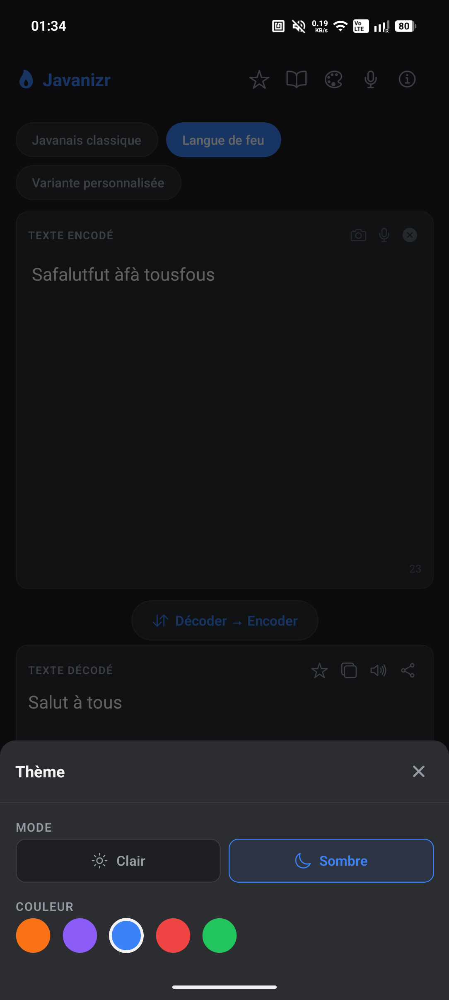
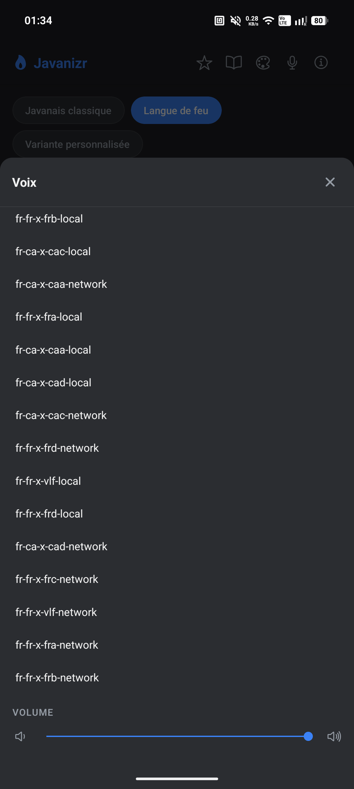
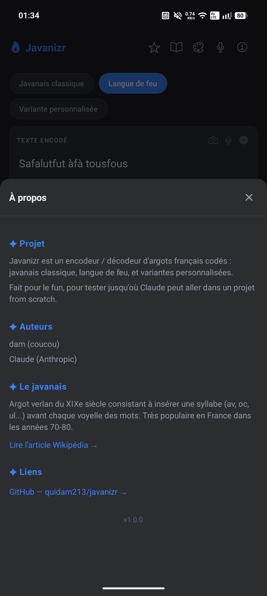
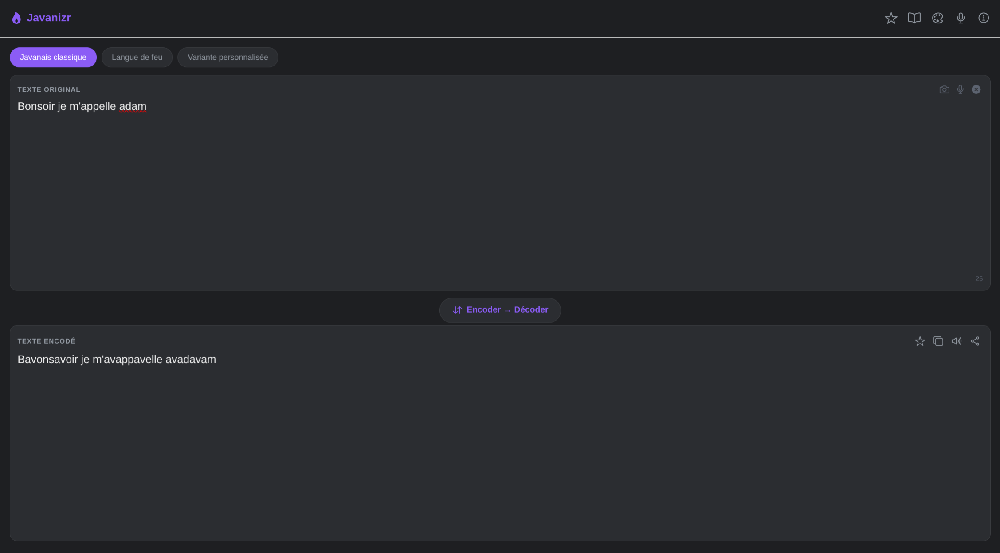

# Javanizr

Application mobile de traduction d'argots français codés — javanais classique, langue de feu, et variantes personnalisées.

## Aperçu

<table>
  <tr>
    <td></td>
    <td></td>
    <td></td>
    <td></td>
  </tr>
  <tr>
    <td align="center">Javanais classique</td>
    <td align="center">Langue de feu</td>
    <td align="center">Favoris</td>
    <td align="center">Historique</td>
  </tr>
  <tr>
    <td></td>
    <td></td>
    <td></td>
    <td></td>
  </tr>
  <tr>
    <td align="center">Thème</td>
    <td align="center">Voix</td>
    <td align="center">À propos</td>
    <td></td>
  </tr>
</table>

**Version web**



## Fonctionnalités

- Encodage et décodage en javanais classique (`av`)
- Encodage et décodage en langue de feu
- Variantes personnalisées (syllabe libre)
- Gestion des cas spéciaux : e muet, groupes de voyelles, sons composés, ponctuation
- Historique persistant des opérations (AsyncStorage, 50 entrées max, dédupliqué) avec date/heure
- Favoris persistants — étoile directement sur le résultat ou depuis l'historique
- Copie du résultat dans le presse-papier et partage natif
- Thème entièrement personnalisable : mode clair/sombre × 5 couleurs d'accent
- Synthèse vocale (TTS) du résultat avec sélecteur de voix et slider volume
- Dictée vocale (STT) en français pour saisir le texte à la voix
- Reconnaissance de texte par photo (OCR) via ML Kit (Android) / Vision (iOS)
- Modal "À propos" avec liens vers Wikipédia et GitHub
- Icône et favicon personnalisés (flamme)

## Structure du projet
```
javanizr/
├── packages/
│   ├── core/          ← Moteur d'encodage/décodage (TypeScript)
│   │   ├── src/
│   │   └── tests/     ← 41 tests unitaires
│   └── app/           ← Application mobile (Expo)
│       ├── app/       ← Écrans (Expo Router)
│       ├── lib/       ← Thème et styles dynamiques
│       └── public/
│           └── favicon.png   ← Icône app + favicon web
├── docs/
│   ├── mobile_screenshots/
│   └── privacy-policy.html
└── README.md
```

## Installation
```bash
git clone https://github.com/quidam213/javanizr.git
cd javanizr
npm install
```

## Tests

41 tests unitaires couvrant les 3 variants, encodage et décodage :

| Fichier | Couverture |
|---|---|
| `basics.test.ts` | Utilitaires : détection voyelles, e muet, groupes |
| `jav/jav_encode.test.ts` | Encodage javanais classique |
| `jav/jav_decode.test.ts` | Décodage javanais classique |
| `feu/feu_encode.test.ts` | Encodage langue de feu |
| `feu/feu_decode.test.ts` | Décodage langue de feu |
| `personnalized/perso_encode.test.ts` | Encodage variante custom |
| `personnalized/perso_decode.test.ts` | Décodage variante custom |

```bash
npm test
```

## Utilisation du Core
```ts
import { encode, decode } from "@javanizr/core"

// Javanais classique
encode("bonjour", "av")   // → "bavonjavour"
decode("bavonjavour", "av") // → "bonjour"

// Langue de feu
encode("bonjour", "feu")  // → "bonfonjourfour"
decode("bonfonjourfour", "feu") // → "bonjour"

// Variante custom
encode("bonjour", "og")   // → "bogonjogour"
decode("bogonjogoor", "og") // → "bonjour"
```

## Lancer l'app

```bash
cd packages/core && npm run build   # compiler le core (requis)
```

### Web (Expo Go suffisant)
```bash
cd packages/app && npx expo start
# appuie sur w pour ouvrir dans le navigateur
```

### Android / iOS (dev build requis)

Les modules natifs TTS, STT et OCR ne fonctionnent pas dans Expo Go. Il faut un dev build EAS :

```bash
cd packages/app
eas build --profile development --platform android
# installe l'APK sur ton appareil, puis :
npx expo start
```

## Déploiement web

```bash
cd packages/app
npx expo export -p web    # génère dist/
```

Dépose le dossier `dist/` sur **Netlify** ou **Vercel**.

## Publication sur les stores

### Google Play Store
```bash
eas build --profile production --platform android
eas submit --platform android
```
Prérequis : compte Google Play Developer (25 $ une fois).

### Apple App Store
```bash
eas build --profile production --platform ios
eas submit --platform ios
```
Prérequis : compte Apple Developer (99 $/an).

## Roadmap

- [x] Core Engine — encodage/décodage (41 tests)
- [x] App mobile Expo — mode texte (javanais, langue de feu, variante custom)
- [x] Mode audio — TTS (synthèse vocale) + STT (dictée vocale fr-FR)
- [x] Mode photo — OCR via ML Kit (Android) / Vision (iOS)

## Licence

MIT
